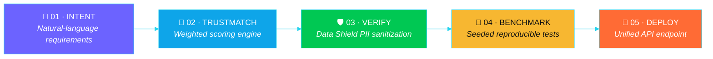
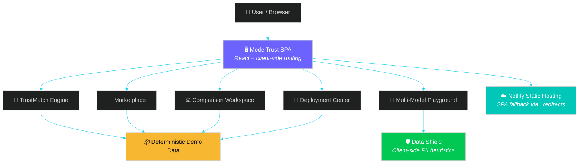

<!--
╔══════════════════════════════════════════════════════════════════════════╗
║  ⭐ ModelTrust Exchange — README.md ⭐                                                ║
║  Optional animated banner included below (capsule-render).                            ║
║  If the service hiccups, simply delete the  tag — nothing breaks.                ║
╚══════════════════════════════════════════════════════════════════════════╝
-->

<!-- ✨ ANIMATED WAVE BANNER -->
<p align="center">

</p>

<!-- ⌨️ TYPING ANIMATION -->
<p align="center">

</p>

<h3 align="center">Don't just find an AI model. <i>Know why you can trust it.</i> 🔐</h3>

<p align="center">
<b>ModelTrust Exchange</b> is an AI Model Marketplace & Intelligence Platform —<br/>
one unified experience for <b>discovery</b>, <b>comparison</b>, <b>evaluation</b> & <b>deployment</b> of AI models<br/>
with transparent quality, cost, latency, reliability, carbon & trust intelligence. 🌍
</p>

<!-- 🚀 PRIMARY CTA BUTTONS -->
<p align="center">
<a href="https://modeltrust-exchange.netlify.app/"></a>
<a href="https://youtu.be/oiEfzVUysG0?si=0KZwLY1pHKbMkyzJ"></a>
<a href="https://github.com/jeevandeep2/modeltrust-exchange"></a>
<a href="https://github.com/jeevandeep2/modeltrust-exchange/stargazers"></a>
</p>

<!-- 🏷️ TAG BADGES -->
<p align="center">


</p>


## 🎯 Quick Navigation

| 🧭 | Section | 💡 What you'll find |
| :---: | :--- | :--- |
| 📸 | [Project Snapshot](#-project-snapshot) | The 30-second overview |
| 💭 | [The Problem](#-the-problem) | Why this exists |
| 🧠 | [What It Is](#-what-is-modeltrust-exchange) | Concept explained |
| ⚙️ | [How It Works](#-how-it-works) | The guided pipeline |
| ✨ | [Features](#-feature-tour) | Full feature tour |
| 🏗️ | [Architecture](#%EF%B8%8F-architecture) | System design diagrams |
| 🛠️ | [Tech Stack](#%EF%B8%8F-technology-stack) | Built with |
| 🗺️ | [Roadmap](#-roadmap) | Now & next |
| 🚀 | [Getting Started](#-getting-started) | Run it locally |
| 🤝 | [Contributing](#-contributing) | Join us |


## 📸 Project Snapshot


|  |  |
| :--- | :--- |
| **📦 Project** | ModelTrust Exchange |
| **🗂️ Category** | AI Platform · Developer Tools |
| **🌐 Domain** | AI Model Marketplace & Intelligence |
| **🏁 Event** | CodeFury Hackathon 2026 🏆 |
| **🔵 Status** | Prototype — full deterministic Demo Mode |
| **🔗 Website** | [modeltrust-exchange.netlify.app](https://modeltrust-exchange.netlify.app/) |
| **🎥 Demo** | [Watch on YouTube](https://youtu.be/oiEfzVUysG0?si=0KZwLY1pHKbMkyzJ) |
| **💻 Repository** | [github.com/jeevandeep2](https://github.com/jeevandeep2/modeltrust-exchange) |
| **📄 License** | Not specified (all rights reserved) |

<br clear="right"/>


## 💭 The Problem

The AI ecosystem is exploding 💥. Every single day, new models ship with wildly different:

<p align="center">


</p>

More choice → more complexity. A developer doesn't just need *a* model — they need the **right** model for their **budget, latency, language, compliance, and use case**.

> ### 🤔 With thousands of AI models available...
> ## *How do you decide which one is actually suitable — and why you can trust it?*


## 🧠 What is ModelTrust Exchange?

**ModelTrust Exchange** unifies model discovery and evaluation into a single, beautiful interface.

No more juggling provider docs, pricing pages, and benchmark blogs. Explore a curated catalog of AI models — inspect transparent trust scores, compare capabilities side-by-side, test prompts in a multi-model playground, and provision deployments from **one place**.

> | 👤 | **Who it's for** | Developers, AI engineers, product teams, students & anyone evaluating AI models |
> |:--:|:---|:---|
> | ⚙️ | **How it works today** | Fully client-side prototype — every metric & output deterministically simulated, no API keys needed |
> | 💜 | **Why it exists** | Choosing an AI model is getting *harder* even as finding one gets *easier* |


## ⚙️ How It Works

Our guided intelligence pipeline:

<p align="center">

</p>



**From spec to deployment in 4 steps:**

| Step | Action | Result |
| :---: | :--- | :--- |
| **1️⃣** | **Define Requirements** | State latency limits, budget targets, task modality & language |
| **2️⃣** | **Run TrustMatch** | Instant weighted scores + transparent tradeoff explanations |
| **3️⃣** | **Test in Playground** | Compare up to 4 models side-by-side with live Data Shield |
| **4️⃣** | **Deploy via Unified API** | Universal endpoint concept, route traffic by performance |


## ✨ Feature Tour

<table>
<tr>
<td width="33%" valign="top" align="center">

### 🧠 TrustMatch Engine


Describe your project in plain language. The engine extracts requirements and computes **Pareto-aware fit scores** across quality, cost, latency, reliability & safety — with a transparent explanation for every recommendation.

</td>
<td width="33%" valign="top" align="center">

### 🛡️ Enterprise Data Shield


Client-side heuristic PII detection that scrubs **Aadhaar, PAN, GSTIN, Indian mobile numbers & emails** from prompts *before* they reach any endpoint — nothing ever leaves the browser.

</td>
<td width="33%" valign="top" align="center">

### 🇮🇳 India Readiness Index


First-class signals for Indic scripts, Hinglish code-switching, regional business terminology & **DPDP Act alignment** — Indian-language use cases get real visibility.

</td>
</tr>
<tr>
<td width="33%" valign="top" align="center">

### 🔎 AI Marketplace


Model cards with transparent **trust scores, latency, cost, reliability, carbon footprint (gCO₂)** & DPDP-readiness indicators.

</td>
<td width="33%" valign="top" align="center">

### ⚖️ Model Comparison


Side-by-side: metrics, **capability radar**, latency chart, monthly cost projections & best-per-category callouts.

</td>
<td width="33%" valign="top" align="center">

### 🧪 Multi-Model Playground


Test up to **4 models simultaneously** with simulated inference + live Data Shield scrubbing — one view, one prompt, four answers.

</td>
</tr>
<tr>
<td width="33%" valign="top" align="center">

### 🚀 Deployment Center


Managed cloud APIs, private endpoints & local edge runtimes — configure, provision & monitor from one dashboard.

</td>
<td width="33%" valign="top" align="center">

### 🎚️ Transparent Scoring


Adjust Quality/Cost/Latency/Reliability/Safety weights in real time — rankings & explanations update **instantly**.

</td>
<td width="33%" valign="top" align="center">

### 🧪 Full Demo Mode


Every metric, log & output is **deterministically simulated**. Explore everything — no keys, no accounts, no payments.

</td>
</tr>
</table>


## 🏗️ Architecture

Fully client-side single-page application — production build deployed as a static site on Netlify.



> 💡 **No backend. No database. No auth.** All engines run in the browser against deterministic data — which is exactly what makes Demo Mode possible.


## 🛠️ Technology Stack

<p align="center">


</p>

| Layer | Technology |
| :--- | :--- |
| 🖥️ **Frontend** | React SPA (client-side routing) |
| 🎨 **Styling** | Tailwind CSS utility classes |
| 📜 **Language** | JavaScript (ES modules) |
| 📦 **Build** | Vite (hashed `assets/` output) |
| 🔤 **Fonts** | Inter & JetBrains Mono |
| 🧩 **Icons** | Inline SVG icon set (`icons.svg`) |
| ☁️ **Deploy** | Netlify static hosting + SPA fallback |


## 📁 Project Structure

```javascript
modeltrust-exchange/
├── 📂 assets/
│   ├── index-XXXX.css        # Compiled Tailwind stylesheet
│   └── index-XXXX.js         # Compiled SPA bundle + demo data
├── 🖼️ favicon.svg            # Project logo
├── 🧩 icons.svg              # SVG icon definitions
├── 📄 index.html             # App entry point
├── 🔀 _redirects             # Netlify SPA fallback: /* → /index.html
└── 📘 README.md              # You are here 👋
```


## 🌐 Live Experience

<p align="center">

### 👉 **[modeltrust-exchange.netlify.app](https://modeltrust-exchange.netlify.app/)** 👈

<a href="https://modeltrust-exchange.netlify.app/"></a>

</p>

No sign-up. No API keys. Every metric simulated deterministically — test the **complete workflow end-to-end**. 🎮

## 🎥 Project Demo

<p align="center">
<a href="https://youtu.be/oiEfzVUysG0?si=0KZwLY1pHKbMkyzJ">

</a>
<br/><br/>
<a href="https://youtu.be/oiEfzVUysG0?si=0KZwLY1pHKbMkyzJ"></a>
</p>


## 🗺️ Roadmap

### ✅ Implemented (Demo Mode)

- [x] AI Marketplace with trust-scored model cards
- [x] TrustMatch Engine — natural language → weighted multi-objective scoring
- [x] Adjustable scoring weights with live re-ranking
- [x] Multi-dimensional comparison (radar, latency, cost projection)
- [x] Multi-Model Playground (up to 4 models, side-by-side)
- [x] Data Shield — client-side PII scrubbing (Aadhaar · PAN · GSTIN · mobile · email)
- [x] 🇮🇳 India Readiness Index & DPDP compliance indicators
- [x] Deployment Center — simulated provisioning & telemetry
- [x] Deterministic Demo Mode across the platform
- [x] Netlify deployment with SPA routing

### 🚧 Future Enhancements

- [ ] Live provider API integrations with real inference
- [ ] Real benchmark harnesses (reproducible, seeded)
- [ ] User accounts, saved models & comparison history
- [ ] Continuous model monitoring & version tracking
- [ ] Community-driven trust scoring & reviews
- [ ] Public API for programmatic discovery
- [ ] Team workspaces & shared evaluation reports


## 🏆 CodeFury Hackathon 2026

| # | What We Did |
| :---: | :--- |
| 1️⃣ | 🎯 **Identified** a real problem — model choice is getting harder as AI explodes |
| 2️⃣ | 🎨 **Designed** a unified marketplace + intelligence layer centered on trust |
| 3️⃣ | ⚡ **Rapidly prototyped** — polished, fully client-side, built for demoability |
| 4️⃣ | 💅 **Focused on UI/UX** — dark modern interface, radars, live scoring feedback |
| 5️⃣ | 🧪 **Experimented** — weighted scoring, PII scrubbing, India-readiness signals |
| 6️⃣ | 🚀 **Deployed & demonstrated** — live on Netlify + recorded walkthrough |

> *Built fast. Built to be explored. Built around one question:* **Why should you trust this model?**


## 🎨 Design Philosophy

- 🔍 **Clarity** — every score ships with a visible formula
- 🪟 **Transparency** — tradeoffs surfaced, not hidden; demo data always labeled
- 🔐 **Privacy by default** — Data Shield scrubs PII before anything leaves the browser
- 🧭 **Discoverability** — a curated catalog instead of scattered provider pages
- 🛡️ **Trust as a first-class metric** — alongside cost, latency & quality
- 👐 **Accessible evaluation** — anyone can explore AI selection without keys or setup


## 🚀 Getting Started

No build step required — it's a static SPA. ✨

```bash
# 1️⃣ Clone the repository
git clone https://github.com/jeevandeep2/modeltrust-exchange.git

# 2️⃣ Navigate in
cd modeltrust-exchange

# 3️⃣ Serve with any static server
python3 -m http.server 5173
#   or
npx serve .
```

Then open **http://localhost:5173** 🎉

## ☁️ Deployment

Deployed on **Netlify** → [modeltrust-exchange.netlify.app](https://modeltrust-exchange.netlify.app/)

Works on any static host (Vercel, GitHub Pages, Cloudflare Pages). Ensure SPA fallback to `index.html` — the `_redirects` file is already included:

```javascript
/*    /index.html   200
```


## 🤝 Contributing

Contributions, issues & feature ideas are **welcome**! 💜

```bash
# 1️⃣ Fork the repo, then:
git clone https://github.com/<your-username>/modeltrust-exchange.git

# 2️⃣ Create a branch
git checkout -b feature/your-idea

# 3️⃣ Commit & push
git commit -m "feat: describe your change"
git push origin feature/your-idea

# 4️⃣ Open a Pull Request 🎉
```

<p align="center">


</p>

## 📄 License

**License: Not specified.** No license file is currently included. All rights reserved by default until a license is added.


## 🌍 Our Vision

> ### *AI adoption is no longer limited by the number of available models —*
> ### *it's limited by the ability to* **choose well.**

The long-term vision: a world where **every developer, product team, and organization** can answer, *with evidence*:

> 💬 *"Which model fits my use case, my budget, my latency constraints, my compliance obligations — and* ***why can I trust it?***"

By combining marketplace discovery, transparent evaluation, privacy guardrails & region-aware intelligence, ModelTrust Exchange aims to make **trust-aware AI adoption the default, not the exception.** 🌱


<!-- 🌟 CLOSING ANIMATION -->
<p align="center">

</p>

<h1 align="center">ModelTrust Exchange</h1>
<h3 align="center">🔎 Discover · ⚖️ Compare · 🧪 Evaluate · 🛡️ Trust</h3>

<p align="center">
<a href="https://github.com/jeevandeep2/modeltrust-exchange/stargazers"></a>
<a href="https://modeltrust-exchange.netlify.app/"></a>
<a href="https://youtu.be/oiEfzVUysG0?si=0KZwLY1pHKbMkyzJ"></a>
</p>

<!-- 🌊 ANIMATED WAVE FOOTER -->
<p align="center">

</p>

<p align="center"><sup>Built with 💜 at <b>CodeFury 2026</b> · Made for a world with better AI choices 🌍</sup></p>
