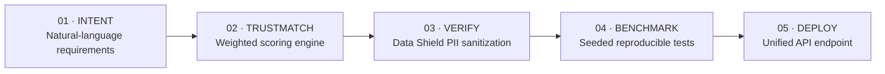
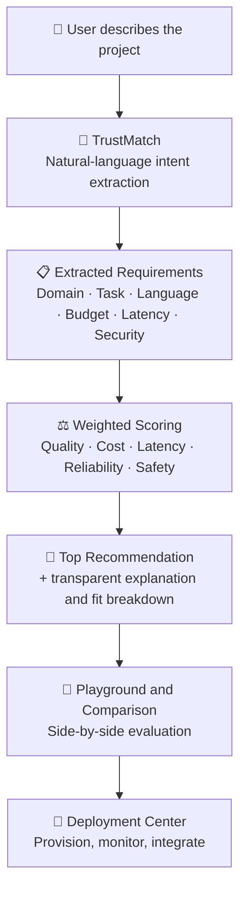
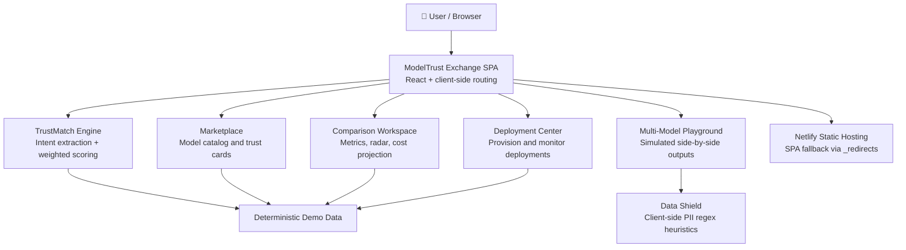

<p align="center">
  
</p>

<p align="center">
  
</p>

<p align="center">
  
</p>

<h3 align="center">Don't just find an AI model. <i>Know why you can trust it.</i></h3>

<p align="center">
  <b>ModelTrust Exchange</b> is an AI Model Marketplace & Intelligence Platform that helps you<br/>
  discover, compare, evaluate, and select AI models through one unified experience —<br/>
  with transparent quality, cost, latency, reliability, carbon impact, and trust intelligence.
</p>

<p align="center">
  <a href="https://modeltrust-exchange.netlify.app/"></a>
  <a href="https://youtu.be/oiEfzVUysG0?si=0KZwLY1pHKbMkyzJ"></a>
  <a href="https://github.com/jeevandeep2/modeltrust-exchange"></a>
  <a href="https://github.com/jeevandeep2/modeltrust-exchange"></a>
</p>

<p align="center">
  
  
  
  
  
</p>

---

## 📌 Project Snapshot

| | |
|:---|:---|
| **Project** | ModelTrust Exchange |
| **Category** | AI Platform · Developer Tools |
| **Domain** | AI Model Marketplace & Intelligence |
| **Event** | CodeFury Hackathon 2026 |
| **Status** | Prototype — all data in deterministic Demo Mode |
| **Website** | [modeltrust-exchange.netlify.app](https://modeltrust-exchange.netlify.app/) |
| **Demo Video** | [Watch on YouTube](https://youtu.be/oiEfzVUysG0?si=0KZwLY1pHKbMkyzJ) |
| **Repository** | [github.com/jeevandeep2/modeltrust-exchange](https://github.com/jeevandeep2/modeltrust-exchange) |
| **License** | Not specified |

---

## 🧠 What is ModelTrust Exchange?

**ModelTrust Exchange** is an AI Model Marketplace & Intelligence Platform that brings model discovery and evaluation into a single, user-friendly interface.

Instead of jumping between provider documentation, pricing pages, and benchmark blogs, users can explore AI models through a centralized experience — inspect transparent trust scores, compare capabilities side-by-side, test prompts in a multi-model playground, and provision deployments from one place.

- **What it does** — helps you find, compare, evaluate, and select AI models with trust-related context.
- **Why it exists** — choosing an AI model is getting harder even as finding one gets easier.
- **Who it's for** — developers, AI engineers, product teams, students, and anyone evaluating AI models.
- **How it works today** — as a fully client-side prototype where every metric and output is deterministically simulated, so anyone can explore the full workflow without API keys.

---

## 💭 The Problem

The AI ecosystem is expanding at an incredible pace. Every day, new models appear with different:

- ⚡ Capabilities
- 🎯 Use cases
- 💰 Costs
- 🚀 Performance characteristics
- 🔐 Privacy considerations
- 🛡️ Trust factors
- 📊 Evaluation criteria

More choice creates more complexity. A developer doesn't just need *a* model — they need the *right* model for their budget, latency constraints, language, compliance needs, and use case.

> **With thousands of AI models available, how do you decide which one is actually suitable for your needs — and why you can trust it?**

---

## 🚀 Our Approach

ModelTrust Exchange explores a unified answer through a guided intelligence pipeline:

<p align="center">
  <b>DISCOVER 🔎 → UNDERSTAND 🧠 → COMPARE ⚖️ → EVALUATE 🛡️ → CHOOSE 🎯 → ACCESS 🚀</b>
</p>



Describe what you're building in plain language → let the TrustMatch engine score candidate models across the dimensions you care about → verify and test with privacy guardrails → deploy through a unified interface.

---

## ✨ Features

<table>
<tr>
<td width="33%" valign="top">

### 🧠 TrustMatch Engine

Describe your project in natural language. The client-side engine extracts requirements (domain, task, language, budget, latency, security) and computes weighted, Pareto-aware fit scores across quality, cost, latency, reliability, and safety — with transparent explanations for every recommendation.

</td>
<td width="33%" valign="top">

### 🛡️ Enterprise Data Shield

Client-side heuristic PII detection that scrubs Aadhaar numbers, PAN, GSTIN, Indian mobile numbers, and email addresses from prompts **before** they reach any model endpoint — zero-leakage redaction with nothing leaving the browser.

</td>
<td width="33%" valign="top">

### 🇮🇳 India Readiness Index

First-class evaluation signals for Indic scripts, Hinglish code-switching, regional business terminology, and DPDP Act alignment — so Indian-language and compliance-sensitive use cases get real visibility.

</td>
</tr>
<tr>
<td width="33%" valign="top">

### 🔎 AI Model Marketplace

A curated catalog of model cards with transparent trust scores, latency, input/output cost, reliability, carbon footprint (gCO₂), developer trust tier, and DPDP-readiness indicators.

</td>
<td width="33%" valign="top">

### ⚖️ Model Comparison

Side-by-side multidimensional comparison: trust score, latency, cost, context window, India readiness, carbon impact, DPDP compliance, and license — with best-per-category callouts, capability radar, latency chart, and monthly cost projections.

</td>
<td width="33%" valign="top">

### 🧪 Multi-Model Playground

Test up to 4 models side-by-side with simulated inference outputs and live Data Shield scrubbing — compare responses for the same prompt in one view.

</td>
</tr>
<tr>
<td width="33%" valign="top">

### 🚀 Deployment Center

Provision managed cloud APIs, private endpoints, or local edge runtimes. Configure target model, region, and hardware acceleration, then monitor active deployments from a single dashboard.

</td>
<td width="33%" valign="top">

### 🎚️ Transparent Scoring Controls

Adjust scoring weights for Quality, Cost, Latency, Reliability, and Safety in real time — rankings, fit breakdowns, and tradeoff explanations update instantly. The scoring formula is displayed openly.

</td>
<td width="33%" valign="top">

### 🧪 Full Demo Mode

Every metric, latency log, benchmark, and inference output is deterministically simulated. Explore the entire platform — no API keys, no accounts, no payment methods required.

</td>
</tr>
</table>

---

## 🔄 How It Works



**From spec to deployment in 4 steps:**

1. **Define Requirements** — state your latency limits, budget targets, task modality, and target language.
2. **Run TrustMatch** — instantly obtain weighted scores, transparent tradeoff explanations, and fallback paths.
3. **Test in the Playground** — compare up to 4 models side-by-side with live Data Shield scrubbing.
4. **Deploy via Unified API** — integrate through a universal endpoint concept and route traffic based on performance.

---

## 🏗️ Architecture

ModelTrust Exchange is a fully client-side single-page application — the repository contains the production build, deployed as a static site on Netlify.



> **Note:** There is no backend server, database, or authentication in the current implementation. All intelligence engines run in the browser against deterministic simulated data — which is exactly what makes Demo Mode possible.

---

## 📸 Product Showcase

Screenshots are not yet included in this repository. In the meantime, explore the live platform to see the marketplace, TrustMatch engine, comparison workspace, playground, and deployment center in action:

<p align="center">
  <a href="https://modeltrust-exchange.netlify.app/"></a>
</p>

---

## 🛠️ Technology Stack

Detected from the production build output in this repository:

<p align="center">
  
  
  
  
  
  
</p>

| Layer | Technology |
|:---|:---|
| **Frontend** | React (single-page application, client-side routing) |
| **Styling** | Tailwind CSS utility classes |
| **Language** | JavaScript (ES modules) |
| **Build** | Vite (hashed `assets/` build output) |
| **Fonts** | Inter & JetBrains Mono via Google Fonts |
| **Icons** | Inline SVG icon set (`icons.svg`) |
| **Deployment** | Netlify static hosting with SPA fallback (`_redirects`) |

---

## 📁 Project Structure

```
modeltrust-exchange/
├── assets/
│   ├── index-C_0qvTrK.css    # Compiled Tailwind CSS stylesheet
│   └── index-DzrVfCF3.js     # Compiled application bundle (SPA logic + demo data)
├── favicon.svg               # Project logo / favicon
├── icons.svg                 # SVG icon definitions
├── index.html                # App entry point (mounts the SPA)
├── _redirects                # Netlify SPA fallback: /* → /index.html
└── README.md                 # You are here
```

> **Note:** This repository contains the production build of the application. There is no `package.json` or source tree here — the app runs entirely as static files.

---

## 🌐 Live Experience

**The platform is live and fully explorable in Demo Mode:**

<p align="center">

### 👉 [modeltrust-exchange.netlify.app](https://modeltrust-exchange.netlify.app/)

<a href="https://modeltrust-exchange.netlify.app/"></a>

</p>

No sign-up. No API keys. Every metric is simulated deterministically so you can test the complete workflow end-to-end.

---

## 🎥 Project Demo

<p align="center">
  <a href="https://youtu.be/oiEfzVUysG0?si=0KZwLY1pHKbMkyzJ">
    
  </a>
  <br/><br/>
  <a href="https://youtu.be/oiEfzVUysG0?si=0KZwLY1pHKbMkyzJ"></a>
</p>

---

## 🏆 CodeFury Hackathon 2026

ModelTrust Exchange was developed as a hackathon project at **CodeFury 2026**.

1. **Identified a real problem** — model choice is getting harder as the AI ecosystem explodes.
2. **Designed a solution** — a unified marketplace + intelligence layer centered on trust.
3. **Rapidly prototyped** — a polished, fully client-side application built for demoability.
4. **Focused on UI/UX** — dark, modern interface with trust scores, radars, and live scoring feedback.
5. **Experimented & iterated** — weighted scoring, PII scrubbing, India-readiness signals.
6. **Deployed & demonstrated** — live on Netlify, with a recorded walkthrough.

> Built fast, built to be explored, built around one question: *why should you trust this model?*

---

## 🎨 Design Philosophy

- **Clarity** — every score comes with a visible formula and explanation.
- **Transparency** — tradeoffs are surfaced, not hidden; demo data is always labeled.
- **Privacy by default** — Data Shield scrubs PII client-side before anything goes out.
- **Discoverability** — a curated, organized catalog instead of scattered provider pages.
- **Trust as a first-class metric** — alongside cost, latency, and quality.
- **Accessibility of evaluation** — anyone can explore AI model selection without keys, accounts, or setup.

---

## 🔮 Roadmap

**✅ Implemented (in Demo Mode)**

- AI Model Marketplace with trust-scored model cards
- TrustMatch Engine — natural-language intent → weighted multi-objective scoring
- Adjustable scoring weights with live re-ranking and explanations
- Model Comparison — metrics table, radar chart, latency chart, cost projection
- Multi-Model Playground — up to 4 simulated models side-by-side
- Data Shield — client-side PII heuristic scrubbing (Aadhaar, PAN, GSTIN, mobile, email)
- India Readiness Index & DPDP Act compliance indicators
- Deployment Center — provisioning UI with simulated endpoints and telemetry
- Deterministic Demo Mode across the entire platform
- Netlify deployment with SPA routing

**🚧 Future Enhancements**

- Live provider API integrations with real inference
- Real benchmark harnesses with reproducible, seeded evaluations
- User accounts, saved models, and comparison history
- Continuous model monitoring and version tracking
- Advanced trust scoring with community reviews
- Public API for programmatic model discovery
- Team workspaces and shared evaluation reports

---

## 🌍 Vision

AI adoption is no longer limited by the number of available models — it is limited by the ability to *choose well*.

The long-term vision for ModelTrust Exchange is a world where every developer, product team, and organization can answer, with evidence: *Which model fits my use case, my budget, my latency constraints, my compliance obligations — and why can I trust it?*

By combining marketplace discovery, transparent evaluation, privacy guardrails, and region-aware intelligence, ModelTrust Exchange aims to make trust-aware AI adoption the default, not the exception.

---

## 🚀 Getting Started

The project is a static single-page application — no build step or dependencies are required to run it.

```bash
# 1. Clone the repository
git clone https://github.com/jeevandeep2/modeltrust-exchange.git

# 2. Navigate into the project
cd modeltrust-exchange

# 3. Serve the static files with any local server, for example:
python3 -m http.server 5173
# or
npx serve .
```

Then open `http://localhost:5173` in your browser. The `_redirects` file handles client-side routing on Netlify; for local multi-route browsing, use any static server that falls back to `index.html`.

---

## ☁️ Deployment

The project is currently deployed as a static site on **Netlify**: 👉 **https://modeltrust-exchange.netlify.app/**

Because the app is a fully static SPA, it can be hosted on any static hosting provider (Netlify, Vercel, GitHub Pages, Cloudflare Pages). For single-page-app routing, ensure all paths fall back to `index.html` — this repository already includes a Netlify `_redirects` file:

```
/*    /index.html   200
```

---

## 🤝 Contributing

Contributions, issues, and feature ideas are welcome.

1. **Fork** the repository
2. **Clone** your fork — `git clone https://github.com/<your-username>/modeltrust-exchange.git`
3. **Create a branch** — `git checkout -b feature/your-idea`
4. **Commit** your changes — `git commit -m "feat: describe your change"`
5. **Push** to your fork — `git push origin feature/your-idea`
6. **Open a Pull Request**

---

## 📄 License

**License: Not specified.** No license file is currently included in this repository. All rights are reserved by default until a license is added.

---

<p align="center">
  
</p>

<h1 align="center">ModelTrust Exchange</h1>
<h3 align="center">Discover · Compare · Evaluate · Trust</h3>

<p align="center">
  <a href="https://github.com/jeevandeep2/modeltrust-exchange"></a>
  <a href="https://modeltrust-exchange.netlify.app/"></a>
  <a href="https://youtu.be/oiEfzVUysG0?si=0KZwLY1pHKbMkyzJ"><img src="ht
